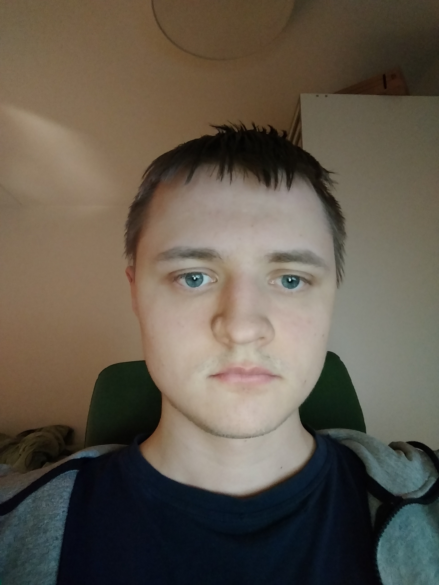
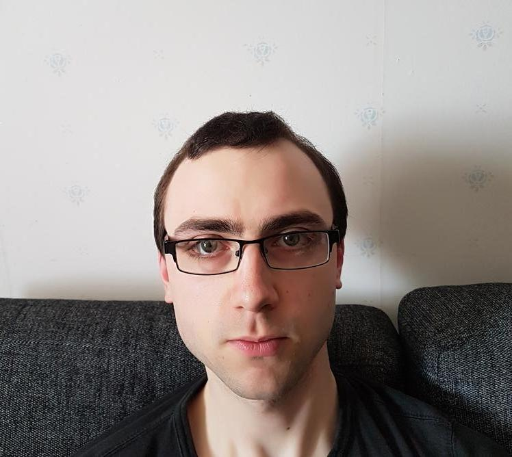
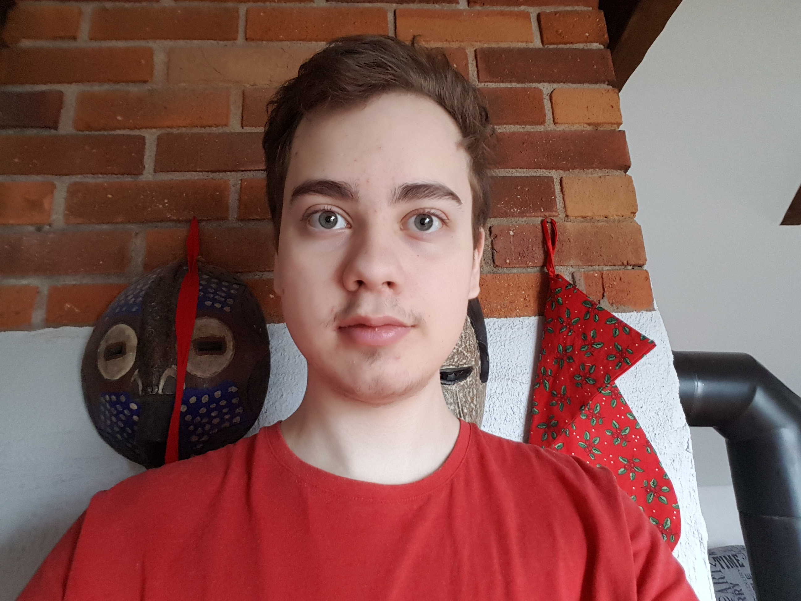
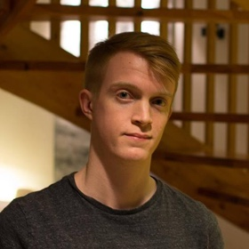
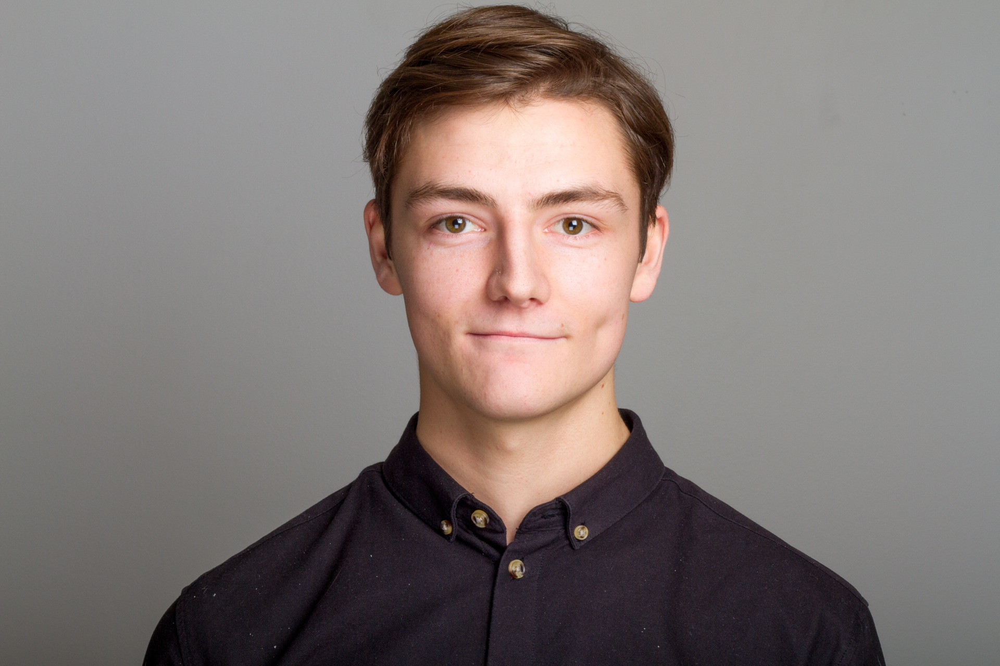
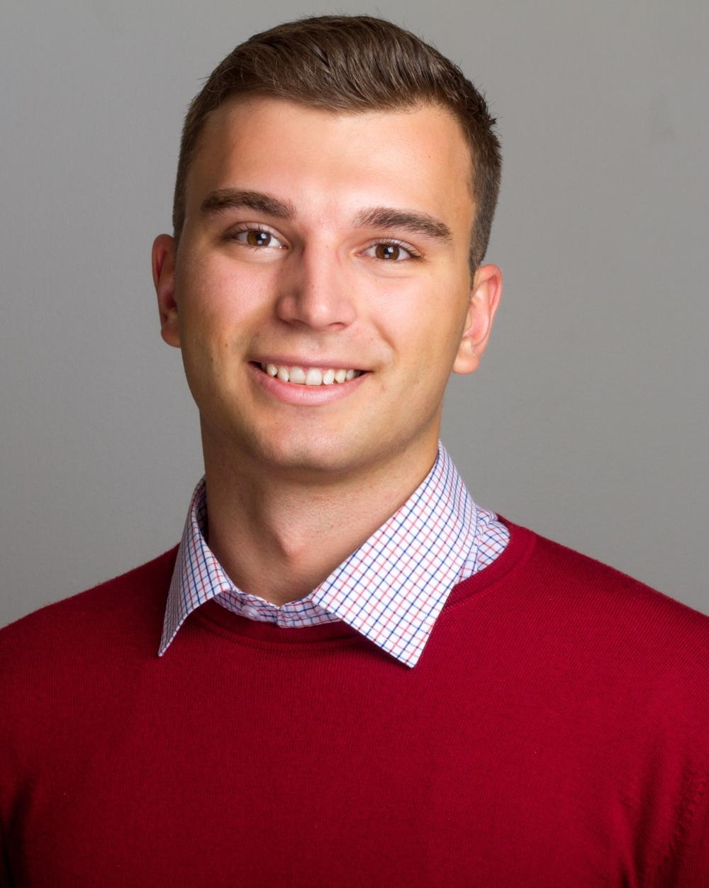
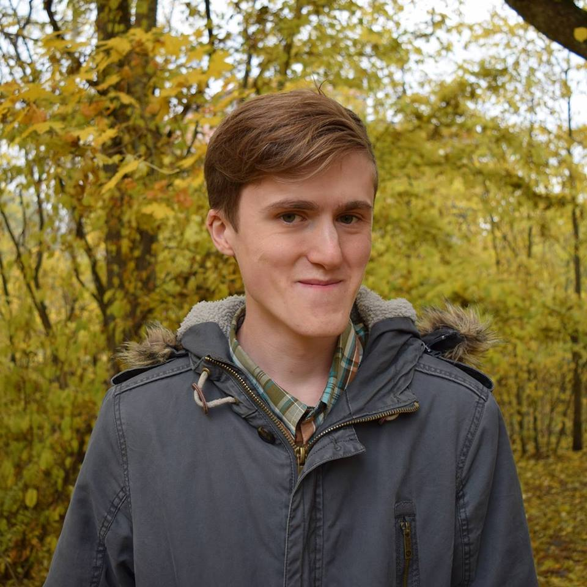

# Medlemmar

**TODO:** Tabellen skall vara sorterad på förnamn.

OSPP (1DT096) 2018 - Projekt zeta

Bild                                     | Förnamn                     | Efternamn | Personnummer | Användarnamn (GitHub)
-----------------------------------------|-----------------------------|-----------|--------------|----------------------
 | [Axel](#Axel-Hultin) | Hultin | 940913  | `huntexD`
 | [Daniel](#Daniel-Degirmen) | Degirmen | 920626-2033 | `dannebra`
 | [David](#david-håkansson) | Håkansson | 971113  | `daha2574`
 | [Fredrik](#fredrik-andersson) | Andersson | 930804  | `freddedotme`
 | [Viktor](#viktor-enzell) | Enzell | 960113-2658  | `viktor-enzell`
 | [Johannes](#JohannesAlmroth) | Almroth | 951129-2931  | `JohannesAlmroth
 | [Love](#LoveNordling) | Nordling | 951106-3258  | `LoveNordling

## Axel Hultin

### Okänd talang

Bra på att kolla serier på Netflix

### Starka sidor

- Problem lösning
- Skriva kod utifrån specifikationer
- Bug fixning

### Personlig utveckling

Under projektet hoppas jag bli bättre på:

- Object-orienterad programmering
- Optimering av kod/program
- Muntliga presentationer

## Daniel Degirmen

## Okänd talang

Proffs på Sudoku.

### Starka sidor

- Problemlösning och algorimter
- Rapportskrivning
- Sammanställning av information
- Planering
- Disciplinerad

### Personlig utveckling

Under projektet hoppas jag bli bättre på:

- Concurrency
- Muntlig presentation

## David Håkansson

### Okänd talang 

Kapabel sjusovare

### Starka sidor

Under projektet tror jag att jag kommer ha lättast att bidra med:

- Problem lösning
- Skriva kod utifrån specifikationer

### Personlig utveckling

Under projektet hoppas jag förutom att bli ännu bättre på mina redan
starka sidor även ges möjlighet att utveckla följande färdigheter:

- git
- muntlig presentation
- rapportskrivande

## Fredrik Andersson

### Okänd talang

Proffs på badminton.

### Starka sidor

Under projektet tror jag att jag kommer ha lättast att bidra med:

- grafisk design
- bra, välskriven kod
- humor/motivation

### Personlig utveckling

Under projektet hoppas jag förutom att bli ännu bättre på mina redan
starka sidor även ges möjlighet att utveckla följande färdigheter:

- concurrency
- problemlösning och algoritmer
- git i grupp
- mer kunskap om grafikmotorer
- optimera kod för prestanda

## Viktor Enzell

### Okänd talang

Jag är en duktig offpistskidåkare.

### Starka sidor

Under projektet tror jag att jag kommer ha lättast att bidra med:

- kreativt tänkande
- välstrukturerad kod
- grafisk design
- planering

### Personlig utveckling

Under projektet hoppas jag förutom att bli ännu bättre på mina redan
starka sidor även ges möjlighet att utveckla följande färdigheter:

- objektorienterad programmering
- problemlösning och algoritmer
- muntlig presentation

## Johannes Almroth

### Okänd talang

Jag är bäst på Super Smash Bros. Melee

### Starka sidor

Under projektet tror jag att jag kommer ha lättast att bidra med:

- Ledarskap
- Struktur
- Problemlösning
- Planering

### Personlig utveckling

Under projektet hoppas jag förutom att bli ännu bättre på mina redan
starka sidor även ges möjlighet att utveckla följande färdigheter:

- Objektorienterad Programmering
- Problemlösning och Algoritmer

## Love Nordling

### Okänd talang
Äter mycket

### Starka sidor
Mattematisk Problemlösning 
Algoritmer och datastrukturer
Förklara koncept

### Personlig utveckling
Jag hoppas kunna förbättra färdigheter inom:

Concurrency
OOP
Systemdesign
Sammarbete

